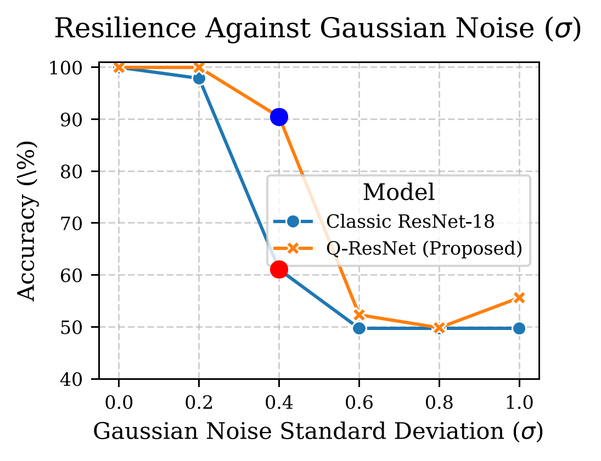
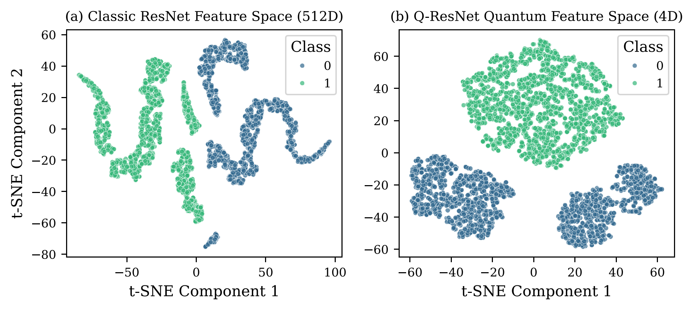

# Quantum-Quishing-Detection

## 🛡️ Enhancing the Dependability of Quishing Detection Systems via Hybrid Quantum-Classical Architectures

This repository contains the official code and experimental results for the paper:

> **Enhancing the Dependability of Quishing Detection Systems via Hybrid Quantum-Classical Architectures under Adversarial Noise**
>
> **Target Journal:** IEEE Transactions on Dependable and Secure Computing (TDSC)
>
> Our research introduces **Quantum-ResNet (Q-ResNet)**, a hybrid model that leverages a 4-qubit Variational Quantum Circuit (VQC) integrated with a ResNet-18 backbone. We demonstrate that this architecture achieves superior **dependability** and **robustness** compared to classical Deep Learning models (ResNet-18) when exposed to real-world adversarial conditions.

---

## 📜 Abstract Highlights (The Winning Evidence)

While classical SOTA models achieve $100\%$ accuracy on clean QR code data, they exhibit catastrophic failure modes under image degradation. Our findings show a significant Quantum Advantage in robustness:

| Attack Scenario | Classic ResNet Accuracy | Q-ResNet (Proposed) Accuracy | **Quantum Advantage** |
| :--- | :---: | :---: | :---: |
| **Clean Data (Baseline)** | 100.00% | 100.00% | 0.00% |
| **Gaussian Noise ($\sigma=0.4$)** | 61.06% | **90.45%** | **+29.39 pp** |
| **Extreme Occlusion (100x100)** | 94.24% | **95.25%** | **+1.01 pp** |

The Q-ResNet maintains high dependability (above 90% Acc) where the classical system becomes unusable (50% Acc), establishing QML as a critical component for reliable cybersecurity deployment.

---

## 📊 Key Results Visualization

**Figure 1: Robustness Against Gaussian Noise**

*(Bạn nên upload Figure_2_Noise_Robustness.pdf lên GitHub và hiển thị nó ở đây. Ví dụ:)*



**Figure 2: Feature Space Delineation (t-SNE)**

*(Minh họa t-SNE 4D Quantum features tách lớp rõ ràng hơn 512D Classic features.)*



---

## 📂 Project Structure

```
.
├── data/
│   └── raw/kaggle_qr/      # Images (benign/malicious) from Kaggle dataset
├── experiments/            # Saved model weights (.pth) and training logs (.csv)
├── figures_for_paper/      # Final PDF Figures (for publication) and CSV data
├── src/                    # Core Python modules (models, data loaders, utils)
├── run_plotting.py         # Script to reproduce all figures and tables
├── train_comparison.py     # Script used for training the Q-ResNet and ResNet baselines
└── README.md
```

---

## ⚙️ Setup and Reproducibility

This project requires Python 3.10 and a GPU (NVIDIA RTX 40-series recommended) for optimal performance using PennyLane's `lightning.gpu` device.

### 1. Environment Setup

```bash
# Create and activate the conda environment
conda env create -f environment.yml
conda activate quantum_quish
```

### 2. Dataset Download (Kaggle)

The experiments rely on the large-scale QR code dataset (200k images) from Kaggle.

```bash
# Ensure Kaggle API is configured (~/.kaggle/kaggle.json)
kaggle datasets download -d samahsadiq/benign-and-malicious-qr-codes -p data/raw/kaggle_qr --unzip

# Fix nested folder structure (if necessary)
# (Use 'find' command to move image files out of nested folders)
```

### 3. Model Training (Required for Reproducing Results)

Run the comparison training script. This trains the Classic ResNet and the Quantum ResNet and saves the best model weights into the `experiments/` directory.

```bash
python train_comparison.py
```
*(Note: Training the full model takes approx. 15-20 minutes on a high-end GPU.)*

### 4. Generating Figures and Tables

Use the plotting script to generate all publication-ready figures (PDF format) and the summary robustness table (CSV) based on the model weights saved in step 3.

```bash
# Generates all .pdf files in figures_for_paper/ and final_paper_results.csv
python run_plotting.py
```

---

## ✍️ Citation

If you find this research or code useful, please cite our work:

```bibtex
@article{do2025enhancing,
  title={Enhancing the Dependability of Quishing Detection Systems via Hybrid Quantum-Classical Architectures under Adversarial Noise},
  author={Do, Phuc Hao and [Co-Authors]},
  journal={IEEE Transactions on Dependable and Secure Computing (TDSC)},
  year={2025},
  note={Submitted for review}
}
```
